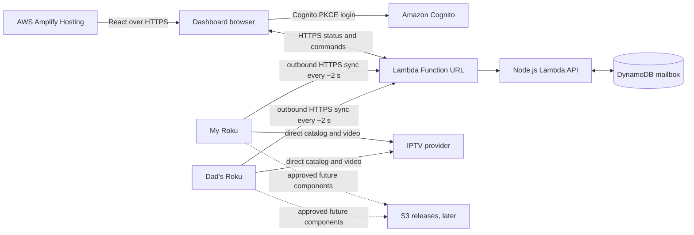

# IPTV control room — system design

Updated October 4, 2026. This supersedes the Lightsail relay design. The CDK stack deploys Amplify Hosting, Cognito, the Lambda Function URL, and DynamoDB in `us-east-2`. The API and temporary mailbox passed live cloud checks, and the owner has used the dashboard with My Roku. Dad's authorization is deployed, but his Roku has not yet established a session or been validated on hardware.

## Accepted scope

One administrator login manages My Roku and Dad’s Roku. Both apps remain developer-mode sideloads. Each Roku owns its provider credentials, full catalog, favorites, recents, player settings, and actual playback. M3U/Xtream media flows directly from the provider to the Roku, apart from the existing narrow on-device AAC repair. AWS handles control messages and bounded metadata, never video. A few seconds of remote command-delivery delay is acceptable. Software-update support comes last.

## Architecture



The dashboard cannot open an inbound connection to a Roku behind a home router. Each Roku initiates HTTPS to the public Lambda URL; Lambda reads or writes the shared mailbox. No home port forwarding, VPN, or public Roku installer is required for normal control. Amplify serves only the website; Cognito authenticates the browser. Lambda Function URL is public at the network layer, so every non-health request must enforce application-level authentication. CORS limits browser origins but is not authorization.

The CloudFormation stack is defined by AWS CDK in `control-room/infra`. It contains Amplify Hosting, a Cognito user pool/client/domain, one DynamoDB Standard table with PK/SK and TTL, one Node.js Lambda, a Function URL, a limited Lambda execution role, and a one-week CloudWatch log group. CDK bootstrap creates its asset-publishing resources through CloudFormation. No Lightsail container/VM, EC2, API Gateway, separately managed CloudFront, Route 53, ACM, RDS, ElastiCache, or Secrets Manager is part of this version. S3 release resources are deferred until software-update support.

The table starts with 5 provisioned RCU and 5 provisioned WCU, subject to real traffic measurements. It holds only the latest device snapshot, short-lived auth/session data, pending commands, and short-lived results. This is a database, but not a viewing-history or full-catalog database. There is no permanently stored IPTV provider password in AWS. A credential replacement does temporarily pass through Lambda and a DynamoDB command; that plaintext is removed after acknowledgment or expiry. DynamoDB TTL deletion can take days, so code must enforce deadlines and explicitly delete expired sensitive commands rather than trusting TTL alone. [DynamoDB TTL behavior](https://docs.aws.amazon.com/amazondynamodb/latest/developerguide/TTL.html).

## Roku integration and sync

The existing app starts in `source/main.brs` and `components/MainScene.brs`. `ConfigTask` loads provider settings, the M3U/Xtream tasks load channels, and `PlayerScreen` owns the Video node. `DashboardTask` is auxiliary: AWS errors cannot delay startup, stop playback, or replace physical-remote control. See the [Roku baseline](roku-architecture-baseline.md).

After installation, the Roku reads a device-specific `source/dashboard.json` baked into its private ZIP. No dashboard pairing form is needed on the TV. That file holds the Lambda URL, an opaque device ID, and a random installation secret. Each TV has a different package and secret. The installation secret is verified against a hash in private backend configuration; the Roku also proves a fresh nonce with Roku-signed device attestation. Lambda checks the trusted certificate, nonce, expected developer ID, and channel ID, then issues a 15-minute opaque session token. The exact physical-device assurance still requires hardware validation; a copied sideload package/secret can weaken it.

While the IPTV app is active, the Roku makes one asynchronous `POST /device/sync` roughly every two seconds. Each request carries the latest bounded playback snapshot and any command results, then receives zero or one command. The browser polls `GET /events` about every 2.5 seconds while visible, less frequently when hidden. These are short requests; Lambda does not hold a 25-second long poll. For a 2-second Roku interval, command delivery waits roughly 0–2 seconds for the next poll, plus network and normal channel buffering. App suspension/exit makes remote control unavailable; the backend does not wake the TV or switch from another Roku app.

```text
Browser -> Lambda -> DynamoDB pending command
Roku -> Lambda sync -> DynamoDB read -> command in sync response
Roku executes locally -> next sync reports result -> DynamoDB -> browser poll
```

Commands include an ID, server-set deadline, app-session ID, source/catalog revisions, and expected playback revision. The Roku deduplicates IDs and resolves provider `stream_id` locally before invoking its existing player path. A local remote action or source change makes stale commands fail. Delivery alone is not success: `playing` is reported only after the Video node confirms playback. Expired commands are rejected in code and removed; TTL is a cleanup backstop. The dashboard distinguishes requested, received, tuning, playing, failed, stale, and expired.

## Channels, metrics, and provider settings

The website does not contact the IPTV provider. It asks the online Roku for categories or bounded channel pages through a temporary catalog command. Xtream `stream_id` is the playback identity; M3U uses a unique `tvg-id` when safe, otherwise an opaque Roku mapping scoped to the catalog revision. Names, channel numbers, and EPG IDs are display/guide data, not tune IDs. Responses omit stream URLs, authorization headers, and credentials. Large results are paged and capped below DynamoDB’s item limit. Catalog data is not permanently imported into AWS.

The Roku reports current channel, player state, app/OS version, and available Video-node metrics. The dashboard displays decimal KB/MB and a labeled recent KB/s window. Missing diagnostics show unavailable rather than zero. Media counters are not complete home-network usage. No daily/monthly viewing history is stored.

For provider changes, the authenticated browser submits the candidate URL/username/password over HTTPS. Lambda stores a short-lived command for the selected device. The Roku receives it on its next sync, validates against the provider from its own network, and saves it to its registry only after validation succeeds. The old credentials remain if validation fails. The command payload is deleted promptly after receipt/result and never returned to the browser. A fresh `--empty-provider` sideload contains no provider credentials, waits for dashboard provisioning without opening the Roku keyboard, and loads its first validated account automatically. Changes to an already configured account apply on the next IPTV-app launch. AWS can see the transient plaintext in this first version, so bodies, tokens, URLs, and passwords must not enter logs or traces. Never put credentials in S3 or Git.

## Authentication and storage boundaries

The sole browser administrator signs in through Cognito authorization-code/PKCE. Lambda verifies issuer, client, access-token use/expiry, and the configured administrator `sub` before reading status or enqueuing commands. Public signup is disabled. Roku requests use installation-secret possession plus fresh attestation for session creation; subsequent syncs verify a hashed session token and its expiry against DynamoDB. CORS, User-Agent, source IP, and caller-supplied device IDs do not authenticate a Roku.

The dashboard's Account panel uses Cognito's user-scoped API to request and verify a new sign-in email and to list/remove passkeys. The pool keeps the old verified email until the replacement is verified, preserving sign-in and recovery during the transition. Cognito managed login handles password resets and passkey registration; the dashboard never stores a password. The immutable Cognito `sub` remains the Lambda authorization identity, so changing email, password, or passkeys does not change Roku access. The app client requests the `aws.cognito.signin.user.admin` scope only for these self-service actions. A new sign-in is required for existing sessions to receive it.

| Data | Durable owner | AWS copy |
| --- | --- | --- |
| Administrator identity | Cognito | Configured admin `sub` in Lambda settings |
| Device secret | Personalized Roku ZIP/registry | SHA-256 verification hash in private deployment settings |
| Provider credentials | Roku registry | Short-lived command payload during replacement only |
| Full catalog and playback URL | Roku/provider | No durable cloud copy |
| Favorites, recents, selected local release | Roku registry | No durable cloud copy |
| Latest state, commands, results, challenges, sessions | DynamoDB | TTL and explicit application deadlines |
| Approved future component releases | S3, later phase | No personalized credentials |

TLS covers browser/Roku traffic to AWS. Lambda sees decrypted control payloads; this is not browser-to-Roku end-to-end encryption. Roku provider media encryption depends separately on each provider URL. IAM permits the API function to access only its mailbox table. Limit log retention and never log successful 2-second sync bodies.

## Cost and capacity

Two Rokus active all day at a 2-second interval make 2,592,000 sync invocations in a 30-day month. At the published 1-million-request Lambda free allowance and $0.20 per million additional requests, request charges would be about **$0.32/month**, assuming the account has not used that allowance elsewhere. A 128 MB function averaging 100 ms would use 32,400 GB-seconds, below the published 400,000 GB-second monthly allowance. Actual duration, browser polls, other Lambda usage, logs, data transfer, and AWS account eligibility can change the bill. A visible browser polling every 2.5 seconds adds requests; the attachment’s $0.32 figure excludes that browser traffic. [Lambda pricing](https://aws.amazon.com/lambda/pricing/).

DynamoDB Standard provisioned 5/5 is within the published 25 RCU/25 WCU and 25 GB monthly free allowance, if available to this payer account and not consumed elsewhere. This is not a $0 guarantee; monitor throttling and billing before changing capacity. Amplify, Cognito, bootstrap S3, future release S3, and CloudWatch may add small usage-based charges. No video transits AWS, so media bandwidth should not affect these backend estimates. [DynamoDB pricing](https://aws.amazon.com/dynamodb/pricing/), [Amplify pricing](https://aws.amazon.com/amplify/pricing/), [Cognito pricing](https://aws.amazon.com/cognito/pricing/).

## Deployment and validation

All infrastructure changes go through CDK synthesis and CloudFormation deployment in `us-east-2` using AWS profile `cam`; generated templates and private config stay out of Git. The fork contains the Roku app, dashboard, backend, CDK, and these design documents. The CloudFormation `ApiUrl` output feeds the dashboard runtime configuration and each personalized Roku package. CDK bootstrap publishes the bundled Lambda asset. No Lightsail image workflow remains. The deployed API has returned a successful health response and rejected an unauthenticated device-list request; a temporary DynamoDB record passed delivery, retry, acknowledgment, completion, and cleanup checks.

Preserve the original ZIP before either sideload. The existing original v1.0.20 ZIP is an app-package backup, not a backup of registry favorites. Roku's read-only developer-mode `query/registry/dev` endpoint can export the current lists and developer ID from the local network; Roku may require “Control by mobile apps” enabled. My Roku returned 403, and the owner elected to proceed without a current favorites/recents backup. Its personalized ZIPs have no restore seed, so a failed sideload or registry reset could erase that local data. The first personalized ZIP exposed a device-attestation return-type mismatch, which was corrected in a later build. Before claiming both TVs are remotely controllable, validate Dad's physical device and two-device isolation, concurrent sync/report/result handling, stale channel changes, provider validation failure, no credential leakage, telemetry accuracy, and local playback during AWS failure. A successful BrightScript compile or CloudFormation deploy does not establish those hardware behaviors.

## Software updates — last phase

S3 can hold approved versioned ComponentLibrary-compatible downloadable components after a device proof and rollback design. A full installed-package replacement still requires a helper with LAN access to the Roku Development Application Installer and developer credentials. Lambda/DynamoDB cannot directly replace a sideloaded SquashFS package across home NAT. Do not expose the development installer to the internet. Release objects must exclude provider credentials and device secrets; S3 object versioning is optional storage protection, not an app updater.
